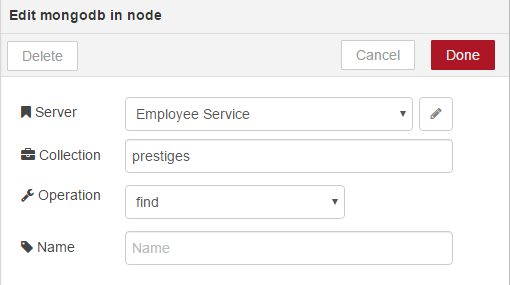

# Prestige Front-end Setup with Node-RED

This guide will show you how to set up Prestige front-end project with Node-RED and MongoDB as replacement for the real API provided by the back-end. This guide assumes you have Git and Node.js installed. To keep things clean it is also advised to create a root folder "Prestige" and execute all the commands from this folder.

## Servers Configuration

### Clone prestige-frontend and authentication server

First of all we need to clone the prestige-frontend repository to a local repository. We also need to clone the authentication server.

```shell
// frontend angular server
git clone https://github.com/Ordineo/prestige-frontend

// authentication server
cd prestige-frontend/src/app/shared
git clone https://github.com/prose/gatekeeper
```

### Installing Angular CLI, Node-RED and MongoDB

Now we need to install Angular CLI and Node-RED packages globally. Make sure the packages are installed globally otherwise they won't properly work.

#### Install angular cli and required servers
```shell
npm install -g @angular/cli

// Install authentication server
cd prestige-frontend/src/app/shared/gatekeeper
npm install

// Install angular server
cd ../prestige-frontend
npm install
```

#### MongoDB
Go to the mongodb website and download MongoDB Community Server. https://www.mongodb.com/download-center?jmp=nav#community


Run the setup and follow all steps.<br>
_This guide assumes that you install mongodb in the recommended place._


## Running servers

First of all we need to configure the authentication server. The only thing we need to do is edit the __config.json__ file in the __gatekeeper__ directory.

Replace everything in the file with this:
```json
{
  "oauth_client_id": "f520e476e9ead285c974",
  "oauth_client_secret": "7d0870433a8630bf73f57deadf84b128f3bbb9ba",
  "oauth_host": importusers,
  "oauth_port": 443,
  "oauth_path": "/login/oauth/access_token",
  "oauth_method": "POST"
}
```

Next we need to run the servers themselves:

```shell
// run authentication server
cd prestige-frontend/src/app/shared/gatekeeper
node server.js

// run angular server
cd ../../../../../prestige-frontend
ng serve
```

Now we should be able to go to http://localhost:4200/ and login without problems. If this works we can move on to the next step.

#### Running MongoDB server

To run the MongoDB we need to specify the data folder in the prestige-frontend root.


```shell
// assuming we are located in the prestige-frontend root folder
// and MongoDB was installed in the recommended place
"%ProgramFiles%\MongoDB\Server\3.4\bin\mongod.exe" --dbpath data

```

### Installing and running Node-RED and MongoDB node

Now we will install Node-RED. This module will also be installed globally.

```shell
npm install -g node-red
node-red
```

After installing node-red, we can install the MongoDB node in the node-red settings directory. This directory is usually located in the __C:/Users/%USERNAME%/.node-red folder__.


```shell
cd %USERPROFILE%/.node-red/
npm install node-red-node-mongodb
```

## Node-RED Web Service

### GET

#### Wiring nodes

First we are going to create the GET endpoint for prestiges.

The nodes we need are:
1. The __http__ node to create the endpoint
1. A __function__ node to specify what to get out of the MongoDB
1. The __MongoDB__ node to get the desired data out of the MongoDB in JSON format (if this node isn't listed you did something wrong with running the MongoDB server or installing the node red MongoDB node)
1. Another __function__ node to parse the JSON data into JSON data that the frontend understands. This basicly adds a __\_embedded__ key and the __prestiges__ key.
1. A __http response__ node. This makes sure you get a response out of your GET request.
1. A __debug__ node. This logs the object that gets returned.

You will have to wire them like this:


#### Configuring nodes

##### Http node:


##### Function node (DB):


##### MongoDB node:
To configure the database node we need to double click the MongoDB node we dragged in and click on "add new mongodb..." and then click on the pencil next to the field. Here we fill in the database configuration. This depends on how you set up the database. Then we click on "Add".




##### Function node (Parse):


```javascript
var name = msg.req.originalUrl.substring(1);
var _embedded = {};
_embedded[name] = msg.payload;
msg.payload = { _embedded: _embedded };

return msg;
```

##### Http response node and debug node:

These nodes don't need configuration.

#### Result

If everything went as planned we now have this wiring.


#### Other endpoints

Now we can copy paste this endpoint and tweak the settings for each endpoint. We can also wire every endpoint through the same hal parser to the same debug and http response nodes. This way we only need to copy paste the first three nodes. If we did everything correct it should look something like this.


### POST

#### Wiring nodes

Now we can create the POST endpoints for prestiges. We need significally less nodes than with the GET endpoints since we are going to reuse the http response node and the debug node.

The nodes we need are:

1. A __http__ node, but now we will put it in POST modus.
1. A  __MongoDB__ node, but now we will use the save operation instead of the find operation.
1. The http response node (gets reused, so no need to create a new one)
1. The debug node (gets reused)

You will need to wire them like this:


#### Configuring nodes

##### Http node:


##### MongoDB node:


#### Result

Now we can copy paste this, tweak every POST endpoint and wire them together and we should get this.


### Final Result

The last thing we need to do is deploy our micro service. We can do this by clicking on the big red button in the top right corner.


If everythingwent well we shouldn't get an error message and get a pop-up that states "succesfully deployed". Now everything should look like this.


### Access

We now can access this service by putting "/prestiges" or any of the other identifiers behind the url.

http://local:1880/prestiges


### Shortcut

You can also skip all the steps above and just import this JSON, but that would spoil the fun, wouldn't it?


```JSON
[{"id":"306bbeb2.38eff2","type":"tab","label":"Prestige Webservice"},{"id":"a311f520.733058","type":"http in","z":"306bbeb2.38eff2","name":"","url":"/prestiges","method":"get","swaggerDoc":"","x":120,"y":300,"wires":[["492abd7f.38f224"]]},{"id":"1bc5bd1f.2a0c93","type":"http response","z":"306bbeb2.38eff2","name":"","x":1210,"y":60,"wires":[]},{"id":"c2a3e3c1.987e9","type":"mongodb in","z":"306bbeb2.38eff2","mongodb":"c12c1252.c5f17","name":"","collection":"prestiges","operation":"find","x":680,"y":300,"wires":[["bf26b989.186208"]]},{"id":"181d0d34.7803b3","type":"debug","z":"306bbeb2.38eff2","name":"","active":true,"console":"false","complete":"payload","x":1210,"y":700,"wires":[]},{"id":"492abd7f.38f224","type":"function","z":"306bbeb2.38eff2","name":"MongoDB Parameters find all","func":"msg.payload = '{}';\nmsg.limit = 100;\nmsg.skip = 0;\n\nreturn msg;","outputs":1,"noerr":0,"x":390,"y":300,"wires":[["c2a3e3c1.987e9"]]},{"id":"bb377b94.329198","type":"http in","z":"306bbeb2.38eff2","name":"","url":"/prestiges","method":"post","swaggerDoc":"","x":1260,"y":300,"wires":[["d98f5817.341218","181d0d34.7803b3","1bc5bd1f.2a0c93"]]},{"id":"d98f5817.341218","type":"mongodb out","z":"306bbeb2.38eff2","mongodb":"c12c1252.c5f17","name":"","collection":"prestiges","payonly":true,"upsert":false,"multi":false,"operation":"store","x":1640,"y":300,"wires":[]},{"id":"21c61269.71a78e","type":"http in","z":"306bbeb2.38eff2","name":"","url":"/prestigeLikes","method":"get","swaggerDoc":"","x":130,"y":360,"wires":[["a784473e.25cce8"]]},{"id":"190d44ea.0d1a7b","type":"http in","z":"306bbeb2.38eff2","name":"","url":"/prestigeLikes","method":"post","swaggerDoc":"","x":1270,"y":360,"wires":[["9f016d93.863da","181d0d34.7803b3","1bc5bd1f.2a0c93"]]},{"id":"84f3a6eb.b59628","type":"http in","z":"306bbeb2.38eff2","name":"","url":"/users","method":"get","swaggerDoc":"","x":110,"y":420,"wires":[["7917c25f.3afb4c"]]},{"id":"101d1fbe.1bb74","type":"http in","z":"306bbeb2.38eff2","name":"","url":"/users","method":"post","swaggerDoc":"","x":1250,"y":420,"wires":[["6f25fc84.1f9554","181d0d34.7803b3","1bc5bd1f.2a0c93"]]},{"id":"41eb7865.3f5b48","type":"http in","z":"306bbeb2.38eff2","name":"","url":"/roles","method":"post","swaggerDoc":"","x":1250,"y":480,"wires":[["60e0a018.8cfb6","181d0d34.7803b3","1bc5bd1f.2a0c93"]]},{"id":"eebb455d.4aa468","type":"http in","z":"306bbeb2.38eff2","name":"","url":"/categories","method":"post","swaggerDoc":"","x":1260,"y":540,"wires":[["a4e92557.94ef78","181d0d34.7803b3","1bc5bd1f.2a0c93"]]},{"id":"a784473e.25cce8","type":"function","z":"306bbeb2.38eff2","name":"MongoDB Parameters find all","func":"msg.payload = '{}';\nmsg.limit = 100;\nmsg.skip = 0;\n\nreturn msg;","outputs":1,"noerr":0,"x":390,"y":360,"wires":[["72863ec4.f5f06"]]},{"id":"7917c25f.3afb4c","type":"function","z":"306bbeb2.38eff2","name":"MongoDB Parameters find all","func":"msg.payload = '{}';\nmsg.limit = 100;\nmsg.skip = 0;\n\nreturn msg;","outputs":1,"noerr":0,"x":390,"y":420,"wires":[["6bedc71d.9ece58"]]},{"id":"72863ec4.f5f06","type":"mongodb in","z":"306bbeb2.38eff2","mongodb":"c12c1252.c5f17","name":"","collection":"prestigeLikes","operation":"find","x":690,"y":360,"wires":[["bf26b989.186208"]]},{"id":"6bedc71d.9ece58","type":"mongodb in","z":"306bbeb2.38eff2","mongodb":"c12c1252.c5f17","name":"","collection":"users","operation":"find","x":670,"y":420,"wires":[["bf26b989.186208"]]},{"id":"9f016d93.863da","type":"mongodb out","z":"306bbeb2.38eff2","mongodb":"c12c1252.c5f17","name":"","collection":"prestigeLikes","payonly":true,"upsert":false,"multi":false,"operation":"store","x":1650,"y":360,"wires":[]},{"id":"6f25fc84.1f9554","type":"mongodb out","z":"306bbeb2.38eff2","mongodb":"c12c1252.c5f17","name":"","collection":"users","payonly":true,"upsert":false,"multi":false,"operation":"store","x":1630,"y":420,"wires":[]},{"id":"60e0a018.8cfb6","type":"mongodb out","z":"306bbeb2.38eff2","mongodb":"c12c1252.c5f17","name":"","collection":"roles","payonly":true,"upsert":false,"multi":false,"operation":"store","x":1630,"y":480,"wires":[]},{"id":"a4e92557.94ef78","type":"mongodb out","z":"306bbeb2.38eff2","mongodb":"c12c1252.c5f17","name":"","collection":"categories","payonly":true,"upsert":false,"multi":false,"operation":"store","x":1650,"y":540,"wires":[]},{"id":"bf26b989.186208","type":"function","z":"306bbeb2.38eff2","name":"Hal Parse","func":"var name = msg.req.originalUrl.substring(1);\nvar obj = {};\nobj[name] = msg.payload;\nmsg.payload = { _embedded: obj };\n\nreturn msg;","outputs":1,"noerr":0,"x":980,"y":400,"wires":[["181d0d34.7803b3","1bc5bd1f.2a0c93"]]},{"id":"eb02deaf.25f07","type":"mongodb in","z":"306bbeb2.38eff2","mongodb":"c12c1252.c5f17","name":"","collection":"roles","operation":"find","x":670,"y":480,"wires":[["bf26b989.186208"]]},{"id":"ec03c4b8.587b58","type":"function","z":"306bbeb2.38eff2","name":"MongoDB Parameters find all","func":"msg.payload = '{}';\nmsg.limit = 100;\nmsg.skip = 0;\n\nreturn msg;","outputs":1,"noerr":0,"x":390,"y":480,"wires":[["eb02deaf.25f07"]]},{"id":"86e55303.7d719","type":"http in","z":"306bbeb2.38eff2","name":"","url":"/roles","method":"get","swaggerDoc":"","x":100,"y":480,"wires":[["ec03c4b8.587b58"]]},{"id":"398c0ef8.343462","type":"http in","z":"306bbeb2.38eff2","name":"","url":"/categories","method":"get","swaggerDoc":"","x":120,"y":540,"wires":[["180a7a1e.909416"]]},{"id":"180a7a1e.909416","type":"function","z":"306bbeb2.38eff2","name":"MongoDB Parameters find all","func":"msg.payload = '{}';\nmsg.limit = 100;\nmsg.skip = 0;\n\nreturn msg;","outputs":1,"noerr":0,"x":390,"y":540,"wires":[["ec7e6f5f.ac656"]]},{"id":"ec7e6f5f.ac656","type":"mongodb in","z":"306bbeb2.38eff2","mongodb":"c12c1252.c5f17","name":"","collection":"categories","operation":"find","x":690,"y":540,"wires":[["bf26b989.186208"]]},{"id":"c12c1252.c5f17","type":"mongodb","z":"","hostname":"127.0.0.1","port":"27017","db":"employee-service","name":"Employee Service"}]
```
